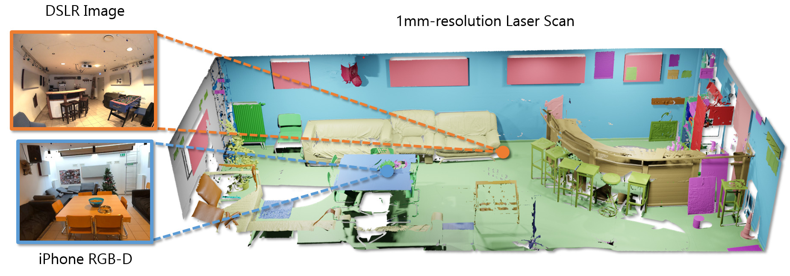
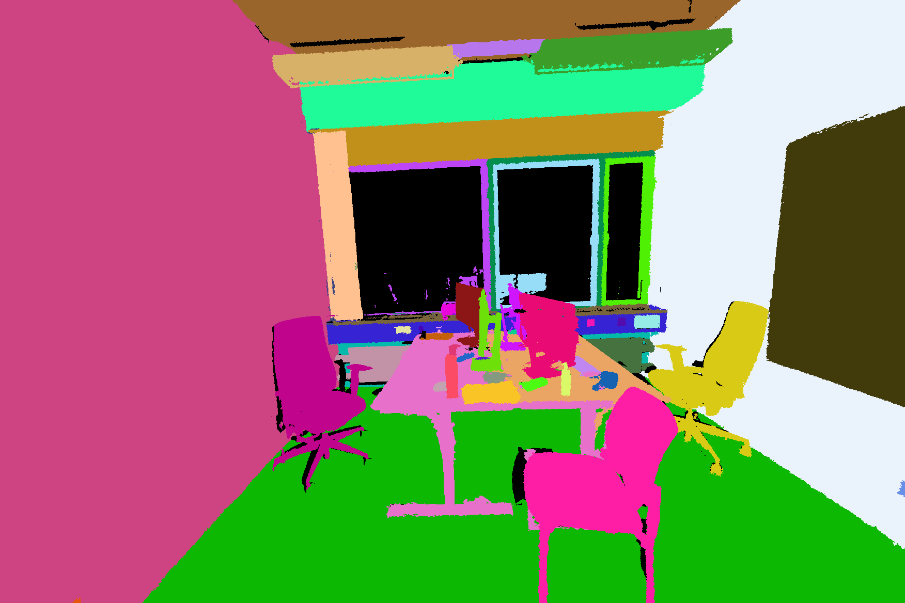

# Toolkit for ScanNet++: A High-Fidelity Dataset of 3D Indoor Scenes

[<ins>Paper</ins>](https://arxiv.org/abs/2308.11417) | [<ins>Dataset</ins>](https://kaldir.vc.in.tum.de/scannetpp/) | [<ins>Video</ins>](https://www.youtube.com/watch?v=E6P9e2r6M8I&pp=ygUJc2Nhbm5ldCsr)



[<ins>Chandan Yeshwanth</ins>](https://scholar.google.com/citations?user=v7SFceoAAAAJ&hl=en)\*, [<ins>Yueh-Cheng Liu</ins>](https://liu115.github.io/)\*, [<ins>Matthias Nießner</ins>](https://niessnerlab.org/) and [<ins>Angela Dai</ins>](https://www.3dunderstanding.org/)

**ICCV 2023**

---
Contents
===
* [Requirements](#requirements)
* [DSLR](#dslr)
    * [Undistortion: convert fisheye images to pinhole with OpenCV](#undistortion-convert-fisheye-images-to-pinhole-with-opencv)
    * [Downscale the DSLR images](#downscale-the-dslr-images)
    * [Undistortion: convert fisheye images to pinhole with COLMAP](#undistortion-convert-fisheye-images-to-pinhole-with-colmap)
    * [Render Depth for DSLR and iPhone](#render-depth-for-dslr-and-iphone)
* [iPhone](#iphone)
    * [Extract RGB frames, masks and depth frames](#extract-rgb-frames-masks-and-depth-frames)
* [3D and 2D Semantics](#semantics)
    * [Prepare 3D Semantics Training Data](#prepare-3d-semantics-training-data)
    * [Split PTH files into chunks for training](#split-pth-files-into-chunks-for-training)
    * [Visualize training data](#visualize-training-data)
    * [Prepare Semantic/Instance Ground Truth Files for Evaluation](#prepare-semanticinstance-ground-truth-files-for-evaluation)
    * [3D Semantic Segmentation Evaluation](#3d-semantic-segmentation-evaluation)
    * [3D Instance Segmentation Evaluation](#3d-instance-segmentation-evaluation)
    * [Rasterize 3D Meshes onto 2D Images](#rasterize-3d-meshes-onto-2d-images)
    * [Get Semantics on 2D Images](#2d-semantics)
    * [Select images with best coverage](#select-images-with-best-coverage)
* [Novel View Synthesis](#novel-view-synthesis)
    * [Novel View Synthesis Evaluation (DSLR)](#novel-view-synthesis-evaluation-dslr)
* [Benchmarks](#benchmarks)
* [Contributing](#contributing)
* [Citation](#citation)

<!-- Created by https://github.com/ekalinin/github-markdown-toc -->
---

## Dataset Documentation
Please refer to the [official dataset documentation](https://kaldir.vc.in.tum.de/scannetpp/documentation) which describes the files in the dataset.

The recommended way of accessing individual files and directories is through the  [scene class](common/scene_release.py).

For evaluation and submission, refer to the [submission instructions](https://kaldir.vc.in.tum.de/scannetpp/benchmark/docs).

## Requirements
```
conda create -n scannetpp python=3.10
conda activate scannetpp
pip install -r requirements.txt
```

## DSLR

### Undistortion: convert fisheye images to pinhole with OpenCV
**This is the official undistortion script that generates the undistortion ground-truth in the benchmark**. This will generate the undistorted images, mask, and the respective transforms.json file for NeRF training.
This is particularly useful if your method support only images with pinhole camera model (e.g., Gaussian Splatting).

Insert `data_root` in `dslr/configs/undistort.yml` and run:
```
python -m dslr.undistort dslr/configs/undistort.yml
```
Additionally, the user can specify the input and output path in the config files.

### Downscale the DSLR images
If you need to downscale the DSLR images to reduce the memory overhead during NeRF training, you can run the following script. The configuration is similar to the undistortion script.

```
python -m dslr.downscale dslr/configs/downscale.yml

```


### Render Depth for DSLR and iPhone

Install the python package from https://github.com/liu115/renderpy in addtion to the requirements.

```
python -m common.render common/configs/render.yml
```
The output will be saved in `output_dir` with the following structure:
```
output_dir/SCENE_ID/[dslr, iphone]
├── render_rgb
└── render_depth
```
The rendered depth maps are single-channel uint16 png, where the unit is mm and 0 means invalid depth.

## iPhone
### Extract RGB frames, masks and depth frames
```
python -m iphone.prepare_iphone_data iphone/configs/prepare_iphone_data.yml
```


## Semantics

### Prepare 3D Semantics Training Data
The meshes may not have a uniform distribution of mesh
vertices and voxelizing these could lead to holes in the data.
Hence, the vertices must not be treated as a *point cloud*.

Instead, please sample points on the surface of the mesh and use
these as inputs for voxelization, etc.

An example of how to do this is given. This script samples points on the mesh and maps 1.5k+ raw labels to the benchmark classes. The mapping file is at `metadata/semantic_benchmark/map_benchmark.csv`

Configure the paths in `semantic/configs/prepare_training_data.yml`


Then run
```
python -m semantic.prep.prepare_training_data semantic/configs/prepare_training_data.yml
```

The resulting PTH files have these fields:
- `scene_id` - str, scene ID
- `sampled_coords` - `(n_samples, 3)`, coordinates of points sampled on the mesh
- `sampled_colors` - `(n_samples, 3)`, RGB colors of points in range [0, 1] (Open3D format)
- `sampled_labels` - `(n_samples,)`, semantic IDs 0-N according to the specified labels file
- `sampled_instance_labels` - `(n_samples,)`, instance IDs
- `sampled_instance_anno_id`: `(n_samples,)`, instance ids corresponding to `segments_anno.json['segGroups']['id']`

### Split PTH files into chunks for training
Split the PTH files into smaller chunks of fixed size. For training, use overlapping chunks and for validation,
set overlap to 0.

```
python -m semantic.prep.split_pth_data semantic/configs/split_pth_data_train.yml
```

### Visualize training data

Configure the PTH data dir, scene list and required outputs in `semantic/configs/viz_pth_data.yml`
```
python -m semantic.viz.viz_pth_data semantic/configs/viz_pth_data.yml
```

### Prepare Semantic/Instance Ground Truth Files for Evaluation
Prepare PTH files similar to the training data step, but without point sampling. Then configure the PTH data dir, scene list and required outputs in `semantic/configs/prepare_semantic_gt.yml`
and run
```
python -m semantic.prep.prepare_semantic_gt semantic/configs/prepare_semantic_gt.yml
```

### 3D Semantic Segmentation Evaluation
For this you need to prepare the semantic ground truth and predictions in the following format
- one file per scene named `<scene_id>.txt`, where each line contains the
label(s) for the corresponding vertex in the mesh. You can specify either a single label
or multiple comma-separate labels in each line. Each line should have the same number of labels, i.e
each file should be an `N x 1` or `N x 3` array for 1 and 3 predictions respectively.

Configure the paths to GT, predictions, label list and downloaded data in `semantic/configs/eval_semantic.yml`

Then run
```
python -m semantic.eval.eval_semantic semantic/configs/eval_semantic.yml
```

### 3D Instance Segmentation Evaluation

See `semantic/eval/eval_instance.py` for details on the input formats.

Configure the paths to GT, predictions, label list and downloaded data in `semantic/configs/eval_instance.yml`

Then run
```
python -m semantic.eval.eval_instance semantic/configs/eval_instance.yml
```

### Rasterize 3D Meshes onto 2D Images
(Requires Pytorch3D and a GPU)

Use this to rasterize the mesh onto DSLR or iPhone images and save the 2D-3D mappings (pixel-to-face) to file.
This can later be used to get the 3D semantic and instance annotations on the 2D images.

Useful params to configure -
- `image_type`: `dslr` or `iphone`
- `image_downsample_factor`: rasterize onto downsampled images, since the 2D images have a very high resolution
- `subsample_factor`: rasterize every Nth image
- `batch_size`: for rasterization

```
python -m semantic.prep.rasterize
```

(Note: This script uses a Hydra config, no need to specify the config path)

### 2D Semantics
Use the rasterization from the previous step to get semantic and instance annotations on the 2D images, either iPhone or DSLR.
Then visualize the object IDs on the image, crop individual objects from the images, etc.

The rasterization data also contains the `zbuf` depth which can be used for backprojection, depth estimation tasks or filtering by distance from the camera.

Configure the `image_type` and `subsample_factor` as before. Use `undistort_dslr` to get semantics on the undistorted images

```
python -m semantic.prep.semantics_2d
```

Visualized object IDs should look like this


### Select Images with Best Coverage
We provide 2 useful functions to select 2D images and save these to a cache file

`scannetpp.common.utils.anno.get_best_views_from_cache`: Order the subsampled images by the next best view that increases the coverage of the scene.

`from scannetpp.common.utils.anno.get_visiblity_from_cache`: Find the visibility of each object in each subsampled image, to filter by the desired visibility

Both functions save the visibility/image list to a cache file so that they don't have to be recomputed each time.

## Novel View Synthesis
### Novel View Synthesis Evaluation (DSLR)
The evaluation script here is the same that runs on the benchmark server. Therefore, it's highly encouraged to run the evaluation script before submitting the results (on the val set) to the benchmark server.


```
python -m eval.nvs --data_root DATA_ROOT --split SPLIT_FILE --pred_dir PRED_DIR
```

The PRED_DIR should have the following structure:
```
SCENE_ID0/
├── DSC00001.JPG
├── DSC00002.JPG
├── ...
SCENE_ID1/
├── ...
```

NOTE:
The evaluation script here is the same that runs on the benchmark server. Therefore, it's highly encouraged to run the evaluation script before submitting the results (on the val set) to the benchmark server.

## Benchmarks
### Semantic Segmentation

This table presents the **Top-1 IoU** and **Top-3 IoU** results for different models on validation and test sets.

| Method     | Top-1 IoU (Val) | Top-3 IoU (Val) | Top-1 IoU (Test) | Top-3 IoU (Test) | Checkpoint | Logs |
|------------|---------------|---------------|----------------|----------------|------------|------|
| PTv3       | **0.488**     | 0.733         | **0.488**      | 0.725          | TBA        | [Wandb](https://api.wandb.ai/links/streakfull-technical-university-of-munich/ed0erarb) |
| CAC        | 0.484         | 0.740         | 0.483          | 0.717          | TBA        | [Wandb](https://api.wandb.ai/links/streakfull-technical-university-of-munich/kxd0k65l) |
| OACNN      | 0.476         | **0.762**     | 0.470          | **0.726**      | TBA        | [Wandb](https://api.wandb.ai/links/streakfull-technical-university-of-munich/gdt3zsq2) |
| Octformer  | 0.477         | 0.737         | 0.460          | 0.691          | TBA        | [Wandb](https://api.wandb.ai/links/streakfull-technical-university-of-munich/ohktxawj) |
| SpUNet     | 0.478         | 0.723         | 0.456          | 0.683          | TBA        | [Wandb](https://api.wandb.ai/links/streakfull-technical-university-of-munich/h87z3y4v) |
| PTv2       | 0.466         | 0.741         | 0.445          | 0.688          | TBA        | [Wandb](https://api.wandb.ai/links/streakfull-technical-university-of-munich/nbcyphpg) |

**Notes:**   
- All **Model Checkpoints** will be released soon.
- Implementation code can be found on [Pointcept](https://github.com/Pointcept/Pointcept).
- Configuration files can be found on Pointcept ScanNet++ [Configurations](https://github.com/Pointcept/Pointcept/tree/main/configs/scannetpp), e.g. [Validation](https://github.com/Pointcept/Pointcept/blob/main/configs/scannetpp/semseg-pt-v3m1-0-base.py), [Test Submission](https://github.com/Pointcept/Pointcept/blob/main/configs/scannetpp/semseg-pt-v3m1-1-submit.py).
- A compiled report for all methods can be found on [Wandb](https://api.wandb.ai/links/streakfull-technical-university-of-munich/q1wvl161).


### Instance Segmentation
This table presents the AP50 results for different models on validation and test sets.
| Method                         | AP50 (Val) | AP50 (Test) | Checkpoint | Logs    |
|--------------------------------|------------|------------|------------|---------|
| SGIFormer                      | 0.411      | 0.457      | TBA        | [Wandb](https://api.wandb.ai/links/streakfull-technical-university-of-munich/h7lx0u4e)|
| SPFormer                       | 0.421      | 0.435      | TBA        | [Wandb](https://api.wandb.ai/links/streakfull-technical-university-of-munich/rovcpos0)|
| OneFormer3D                    | 0.411      | 0.433      | TBA        | [Wandb](https://api.wandb.ai/links/streakfull-technical-university-of-munich/cqz9ocyy)|
| SPFormer-Pretrained Scannet    | 0.419      | 0.432      | TBA        | [Wandb](https://api.wandb.ai/links/streakfull-technical-university-of-munich/x7jrzcxy)|
| PointGroup                     | 0.147      | 0.152      | TBA        | [Wandb](https://api.wandb.ai/links/streakfull-technical-university-of-munich/4u5o6paj)|

**Notes:**   
- All **Model Checkpoints** will be released soon.
- Implementation code and configuration code will be released soon  (Now in open PRs on pointcept  [Pointcept](https://github.com/Pointcept/Pointcept).
- A compiled report for all methods can be found on [Wandb](https://api.wandb.ai/links/streakfull-technical-university-of-munich/297rt3f4).
- Logs containing the title `freq` mean that the metric is average over 500 training steps.

## Contributing
Please open a PR and we'll be happy to review it!

## Citation
If you find our code, dataset or paper useful, please consider citing
```
@inproceedings{yeshwanth2023scannet++,
  title={Scannet++: A high-fidelity dataset of 3d indoor scenes},
  author={Yeshwanth, Chandan and Liu, Yueh-Cheng and Nie{\ss}ner, Matthias and Dai, Angela},
  booktitle={Proceedings of the IEEE/CVF International Conference on Computer Vision},
  pages={12--22},
  year={2023}
}
```
